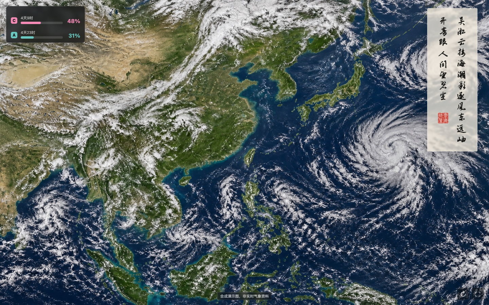
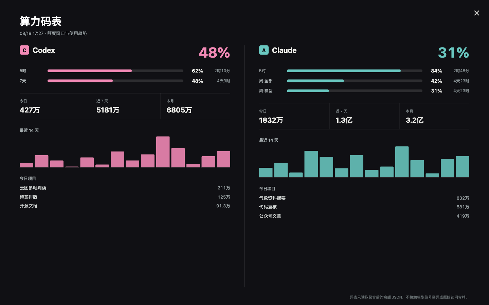
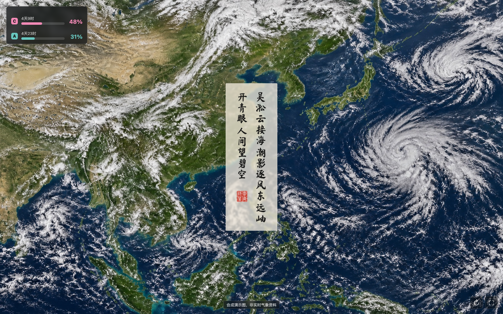

# 云海诗鉴 Yunhai Shijian

> 会读云图的 AI 气象氛围屏：让连续卫星云图、五言诗签与 AI 算力码表，在同一块屏幕上安静地工作。

[](https://github.com/waytosea-oss/yunhai-shijian/actions/workflows/check.yml)
[](LICENSE)
[](package.json)



云海诗鉴不是在云图上贴一句随机诗。它把多帧云图当作时间序列，比较云带的位置、形态与组织变化；再把权威气象快讯作为外部事实交给 AI 核对，生成严格四行、每行五字的中文诗签。屏幕左上角的算力码表，则把 Codex 与 Claude 的额度窗口、刷新时间和近期消耗压缩成一个随时可读的小仪表。

仓库开箱运行的是**合成云图与虚构算力数据**，不包含受限制的实时气象图片、私人账户数据或任何 API 密钥。

## 三层体验

### 1. 远看是一幅会变化的云图

- 全屏云图适配小度类横屏终端、Android 平板、Mac 和普通电脑浏览器。
- 诗签采用竖排书法布局，可拖到任意角落，并自动记住位置。
- 两列顶部对齐，第三句前两字落在右列，印章收在左列末尾，尽量少遮挡云图。

### 2. 点开能看懂今天的天气


单击诗签进入判读页，可查看主要天气现象、移动趋势、对上海与长江口的影响、多帧依据、置信度与国际风云映照。台风名称只能来自外部权威快讯，不能凭一张旋涡状云图臆测。

### 3. 左上角还藏着一只算力码表



单击左上角码表，可展开 Codex / Claude 的额度窗口、刷新倒计时、今日/近 7 天/本月 Token、14 日趋势和项目分布。它只消费聚合后的 JSON，不读取账号密码，也不应接触原始访问令牌。

## 交互细节

| 操作 | 结果 |
| --- | --- |
| 拖动诗签 | 移到不遮挡关键云系的位置，坐标保存在浏览器本地 |
| 单击诗签 | 展开 AI 多帧云图判读 |
| 切换字体 | 在志莽行书与马善政楷书之间切换 |
| 单击算力码表 | 展开额度窗口与使用趋势 |
| 右下角刷新 | 立即更新云图、诗签与码表 |
| 右下角全屏 | 进入浏览器全屏氛围屏 |
| `Esc` | 关闭当前展开面板 |



## 三分钟运行

需要 Node.js 20 或更高版本，不需要安装第三方 npm 依赖。

```bash
git clone https://github.com/waytosea-oss/yunhai-shijian.git
cd yunhai-shijian
npm start
```

打开 [http://127.0.0.1:8790](http://127.0.0.1:8790)。默认演示模式完全离线，适合先看界面和交互。

局域网中的 Android 设备要访问电脑上的服务时：

```bash
HOST=0.0.0.0 npm start
```

然后把 Android 配置中的 `server_url` 改成这台电脑的局域网地址。详见 [Android 使用说明](docs/ANDROID.md)。

## 接入你的数据

复制 `.env.example` 中需要的值到运行环境，或直接在终端设置环境变量。

| 变量 | 作用 |
| --- | --- |
| `YUNHAI_CLOUD_IMAGE` | 本地云图文件或 HTTPS 图片地址 |
| `YUNHAI_POEM_FILE` | AI 判读与五言诗 JSON 文件 |
| `YUNHAI_BALANCE_FILE` | 聚合后的算力码表 JSON 文件 |
| `YUNHAI_UPSTREAM_URL` | 已实现三个兼容接口的上游服务 |
| `OPENAI_API_KEY` | 可选，仅供 `generate-poem.mjs` 调用模型 |
| `YUNHAI_CONTEXT_FILE` | 可选，权威台风、预警、天气及新闻摘要 |

服务同时暴露 Web 版接口和 Android 兼容别名：

| 数据 | Web 接口 | Android 兼容接口 |
| --- | --- | --- |
| 云图 | `/api/cloud` | `/image.jpg` |
| 诗签与判读 | `/api/poem` | `/cloud-poem.json` |
| 算力码表 | `/api/balance` | `/balance.json` |

完整格式见 [API 数据契约](docs/API.md) 与 [算力码表接入说明](docs/BALANCE_METER.md)。

## 生成一首新的云图诗

准备至少两帧按时间排序的云图；如需写入台风名称，再准备一份来自权威机构的文字快讯。

```bash
export OPENAI_API_KEY="your-key"
export YUNHAI_CONTEXT_FILE="/path/to/authoritative-weather-context.txt"
npm run generate -- frame-0800.jpg frame-1000.jpg frame-1200.jpg frame-1400.jpg
```

结果默认写入 `runtime/poem.json`。生成器会拒绝非“四行五字”的结果，并在没有权威外部信息时禁止给热带气旋命名。技术流程与每日更新建议见 [自动化说明](docs/AUTOMATION.md)。

## Android 氛围屏

`apps/android` 是一个无第三方依赖的原生 Android 实现，提供：

- 普通横屏应用入口；
- 系统 `DreamService` 屏保入口；
- 可拖动竖排诗签、判读面板和算力码表；
- 与 Web 版相同的三个数据接口。

它不会自启动、不会常驻保活，也不会修改设备系统设置。构建和安装步骤见 [Android 使用说明](docs/ANDROID.md)。

Mac、Windows、Linux 与 iOS 可直接使用 Web 版；当前仓库没有宣称提供原生 macOS 屏保或 iOS App。

## 项目结构

```text
apps/web/          浏览器与电脑端界面
apps/android/      原生 Android 应用和 DreamService
backend/           零依赖静态服务与可选 AI 生成器
demo/              合成云图、示例诗签、虚构码表数据
docs/              接口、部署、数据与自动化说明
test/              数据契约和 JavaScript 语法检查
```

## 数据与责任边界

- `demo/cloud-synthetic.jpg` 是 AI 生成的合成卫星风格图片，只用于展示界面，不对应任何时刻的真实天气。
- 本仓库不附带实时卫星云图抓取器。接入方必须确认图片、地图、新闻和预警信息的授权与再分发条件。
- AI 判读是辅助观察和文化表达，不是官方天气预报、灾害预警或航海航空决策依据。
- 台风名称、编号和路径必须以权威气象机构发布为准。
- 算力码表示例完全虚构。请只写入聚合数值，不要把 Cookie、密码或 API Token 放入 JSON。

详见 [数据来源与版权边界](docs/DATA_SOURCES.md)。

## 开源

代码与项目生成的图形素材使用 [Apache License 2.0](LICENSE)。仓库内的马善政楷书与志莽行书字体分别遵循其附带的 SIL Open Font License；替换自有印章前请确认素材权利。

欢迎提交 Issue 或 Pull Request。请先阅读 [贡献指南](CONTRIBUTING.md) 与 [安全说明](SECURITY.md)。

---

**云海诗鉴**：把一块闲置屏幕，变成能看云、能写诗、也知道 AI 还剩多少力气的窗。
