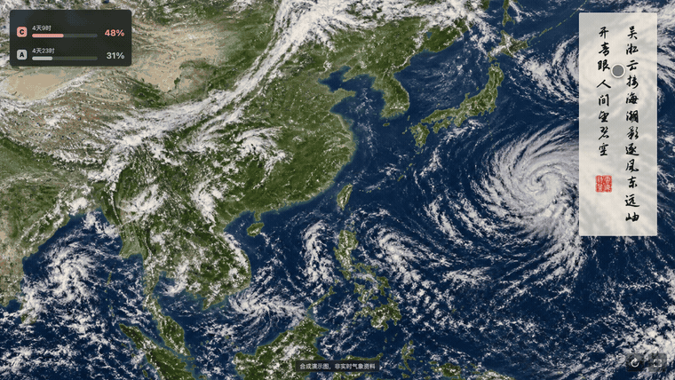
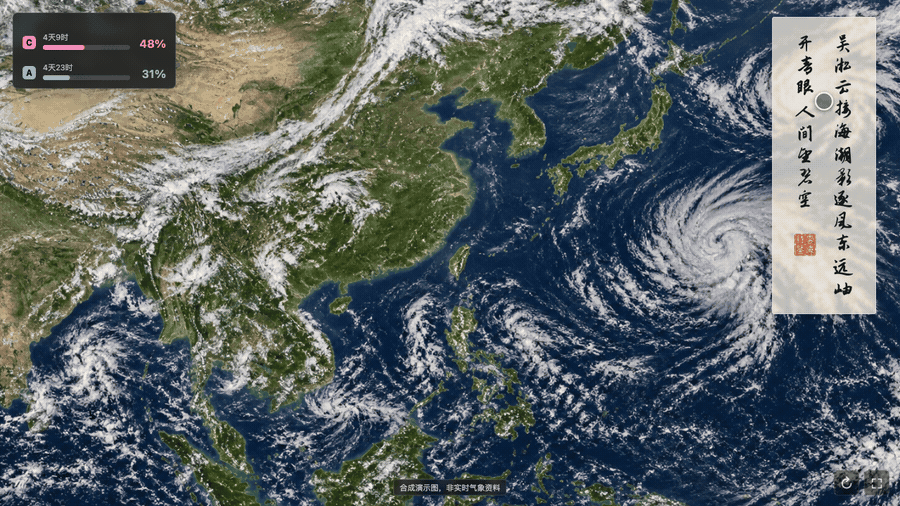
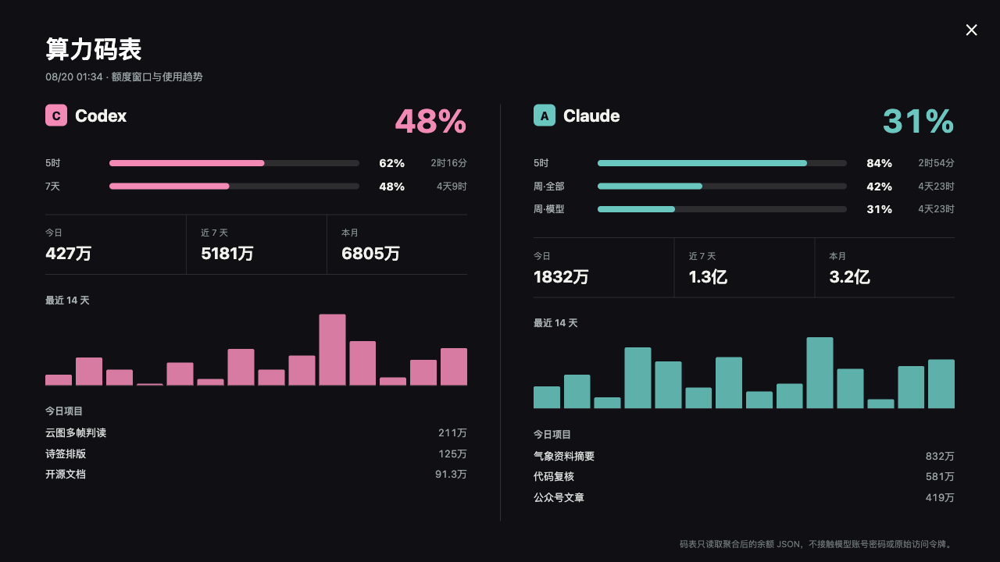
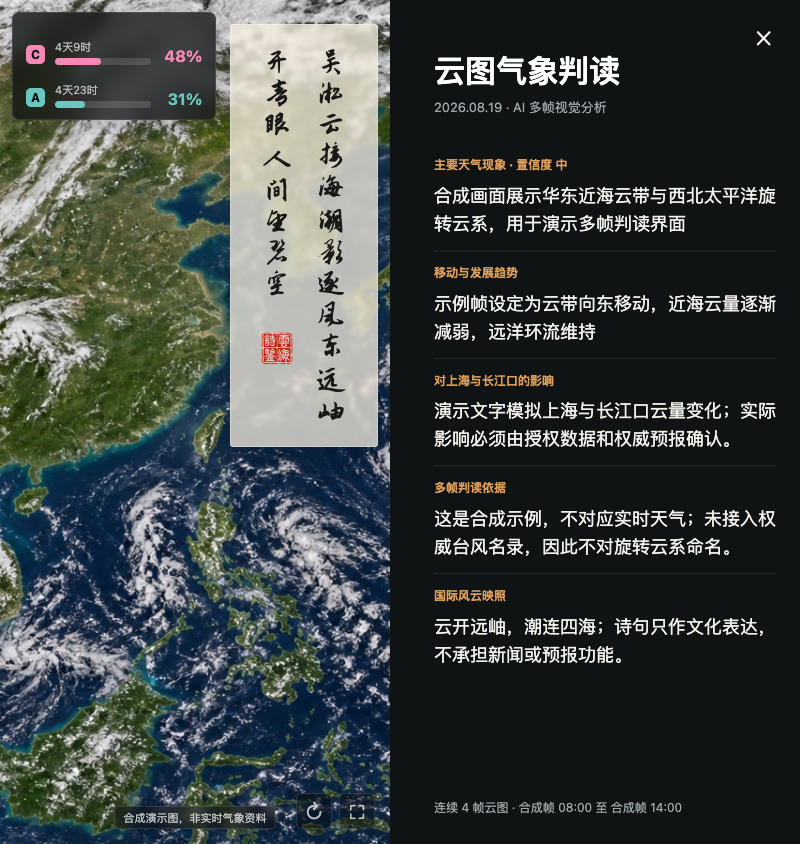

<!--
公众号发布信息（不进入正文）

推荐标题：我把一块闲置屏幕，变成了会读云图的 AI 氛围屏
备选标题：云海诗鉴：会看云、会写诗，还知道 AI 剩多少力气
摘要：它连续看多帧云图，生成五言诗签，展开气象判读，还把 Codex 与 Claude 的额度做成一只算力码表。现在，Web 与 Android 版本已经开源。
封面：images/article/00-cover.jpg
GitHub：https://github.com/waytosea-oss/yunhai-shijian
-->

# 我把一块闲置屏幕，变成了会读云图的 AI 氛围屏

很多人每天都会看天气，却很少真正看一张云图。

天气 App 告诉我们温度、降水概率和风力。卫星云图则更像一张正在书写的地球手稿：海面上的旋转云系、长江口附近的水汽、横跨大陆的冷云带，都在缓慢改变形态。

只看一帧，它像壁纸。

连续看几帧，它才开始讲述时间。

我原本只是想给一台小度智能音箱做一个更耐看的屏保。后来，这件事逐渐长成了一套完整系统：它会读连续云图，会根据天气趋势写一首五言小诗，会把判断依据展开给我看；左上角还放着一只 AI 算力码表，告诉我 Codex 和 Claude 还剩多少可用额度。

我把它叫作 **“云海诗鉴”**。


*公开演示使用合成云图与虚构算力数据，不对应任何时刻的真实天气。*

## 它不是一个天气插件，而是一块每天都会生成内容的屏幕

云海诗鉴的主界面很克制。

大部分面积留给云图。右侧是一枚半透明诗签，左上角是算力码表，右下角只有刷新和全屏两个按钮。远看，它是一幅会变化的云图；靠近一点，才会发现诗、判读和算力信息都藏在里面。

整套系统分成四件事：

**第一，连续看云。**
它读取按时间排列的多帧云图，比较云带位置、旋转结构、边界和组织程度的变化，而不是只对一张图片做静态描述。

**第二，核对事实。**
台风名称、编号、强度、路径和预警必须来自权威气象快讯。AI 可以观察到“像旋转云系的结构”，但不能仅凭形状擅自命名。

**第三，写一首严格的五言诗。**
四行，每行五个字。诗可以把天气、地貌和当日国际风云放在同一个意象里，但不能代替新闻，也不能承担预报功能。

**第四，把依据留下来。**
诗负责留白，判读页负责说明趋势、影响、证据和置信度。好看和可信必须分开表达。

## 一枚不抢画面的竖排诗签

我不希望这首诗变成一块挡住云图的大卡片。

所以诗签被做成窄长条：两列竖排文字顶部对齐，右列多收第三句的前两个字，左列空出的地方落下一方“诗鉴”印章。文字完全不透明，底色半透明，既能读清，又能透出下面的云。

更重要的是，它可以拖动。

如果当天东南海面有值得观察的云系，就把诗签拖到左边；如果北方云带更关键，再挪回右下。位置会保存在浏览器本地，下次打开仍然在原处。



*拖住诗签即可移动，松手后自动记住位置。*

## 点一下诗签，AI 的气象判读就展开了

屏幕上的诗很轻，但生成它之前做过的判断不应该消失。

单击诗签，会展开完整的“云图气象判读”：

- 主要天气现象与置信度；
- 云系的移动和发展趋势；
- 对上海与长江口的可能影响；
- 多帧云图的判断依据；
- 天气意象与当日国际风云的文化映照；
- 使用了多少帧云图、覆盖什么时间段。

判读页右侧仍然保留当天的诗。读者既可以先看结论，也可以回头检查这四句诗从何而来。



*从主屏进入判读页，再把志莽行书切换为马善政楷书。*


字体设置也放在这里。开源版内置 **志莽行书** 和 **马善政楷书**，都附带明确的开源字体许可。启功体等授权边界不清楚的字体没有直接打包进仓库，使用者可以在确认授权后自行替换。


## 左上角为什么还有一只“算力码表”

这是这个项目里最有意思、也最个人化的一部分。

云图记录自然系统的变化，算力码表记录 AI 系统的可用余量。

主屏左上角只显示 Codex 与 Claude 当前最紧张的额度窗口、剩余百分比和刷新倒计时。点开以后，才能看到完整信息：

- 5 小时、7 天或每周额度窗口；
- 今日、近 7 天和本月 Token；
- 最近 14 天使用趋势；
- 当天算力花在了哪些项目上。




它不是厂商账单页，也不直接登录模型账号。网页只读取一份聚合后的 JSON，里面可以有百分比、刷新时间和匿名化项目统计，但绝不能放 API Key、Cookie、密码或完整对话内容。

公开演示中的所有数字都是虚构的。

## 从小度屏保，走到电脑和手机

云海诗鉴最初运行在小度这类横屏终端上，但开源版没有把它锁死在某一台设备里。

现在它提供：

- 浏览器全屏版，适合 Mac、Windows 和 Linux；
- 手机、平板和 iOS 浏览器版；
- 原生 Android 横屏应用；
- Android 系统 DreamService 屏保入口；
- 三个简单接口，用来接入自己的云图、诗签和算力数据。



同一套数据，可以在客厅的小屏幕上安静显示，也可以在电脑上展开阅读。它不是一张固定壁纸，而是一套可以持续更新的内容界面。

## 三分钟体验：怎么把它运行起来

项目已经以 Apache License 2.0 开源。

电脑上安装 Node.js 20 或更高版本后，在终端执行：

```bash
git clone https://github.com/waytosea-oss/yunhai-shijian.git
cd yunhai-shijian
npm start
```

然后打开：

```text
http://127.0.0.1:8790
```

默认演示完全可以离线运行，不需要 API Key，也不会获取真实账户数据。

打开以后，可以直接尝试这些操作：

- **拖动右侧诗签**：把它放到不遮挡关键云系的位置。
- **单击诗签**：展开 AI 多帧云图判读。
- **切换字体**：在志莽行书和马善政楷书之间选择。
- **单击左上码表**：查看 Codex 与 Claude 的额度窗口和趋势。
- **点击右下全屏按钮**：把浏览器变成一块专注的氛围屏。
- **按 Esc**：退出当前展开页面。

## 接入自己的云图，只需要三类数据

开源版把数据层和界面层分开了。

你可以保留现有界面，只替换下面三项：

- **云图**：一张本地图片或合法的 HTTPS 图片地址。
- **诗签**：四行五言诗，以及现象、趋势、影响、证据等 JSON。
- **算力码表**：经过聚合和脱敏的额度 JSON。

启动时分别指定：

```bash
YUNHAI_CLOUD_IMAGE=/path/to/cloud.jpg \
YUNHAI_POEM_FILE=/path/to/poem.json \
YUNHAI_BALANCE_FILE=/path/to/balance.json \
npm start
```

如果要让 Android 设备访问电脑上的服务，可以用：

```bash
HOST=0.0.0.0 npm start
```

再把 Android 端的服务地址改成电脑的局域网 IP。项目文档里已经写好了构建、安装和 DreamService 屏保设置方法。

## 它也可以每天自动更新

一套可靠的日更流程，不应该只有“让 AI 每天写首诗”这么简单。

我把它拆成五步：

1. 获取至少两帧、最好四帧已经授权的云图；
2. 获取权威天气、台风快讯和必要的公开新闻摘要；
3. 让 AI 完成多帧判读并生成严格四行五字的诗；
4. 原子更新云图、诗签和算力 JSON，失败时保留上一版；
5. 等页面刷新后自动截图，把主屏、判读页和数据存档。

macOS 可以用 `launchd`，Linux 可以用 `systemd timer`。个人 API Key、受限云图和私人余额应保留在自己的电脑或服务器上，不应该提交到公开 GitHub 仓库。

## 它能做什么，也要明确它不能做什么

云海诗鉴首先是一块 **AI 气象氛围屏**，其次才是一个技术项目。

它可以帮助人观察云系变化、理解 AI 的判断过程，并让一块闲置屏幕每天出现一点新的内容。

但它不是官方天气预报，不承担灾害预警、航海、航空或应急决策功能。真实部署时，云图、地图、新闻和预警信息都必须确认授权；台风名称与路径必须以权威机构发布为准。

这条边界不是为了削弱产品，而是为了让它能够长期、认真地运行下去。

## 为什么选择开源

一开始，我也想过把它做成一个付费 App。

但我后来发现，真正有意思的不是把它锁进一个应用商店，而是让不同的人把它放到不同的地方：

有人关注南海台风，有人想看青藏高原水汽；有人放在书房，有人放在展厅；有人接入别的模型，有人会写出完全不同的诗。

于是，我把 Web 端、Android 端、DreamService、AI 生成器、数据接口、算力码表和部署文档都整理出来，放到了 GitHub。

**项目地址：<https://github.com/waytosea-oss/yunhai-shijian>**

云在天上走，诗在屏上落，算力在左上角慢慢回满。

这就是云海诗鉴。
